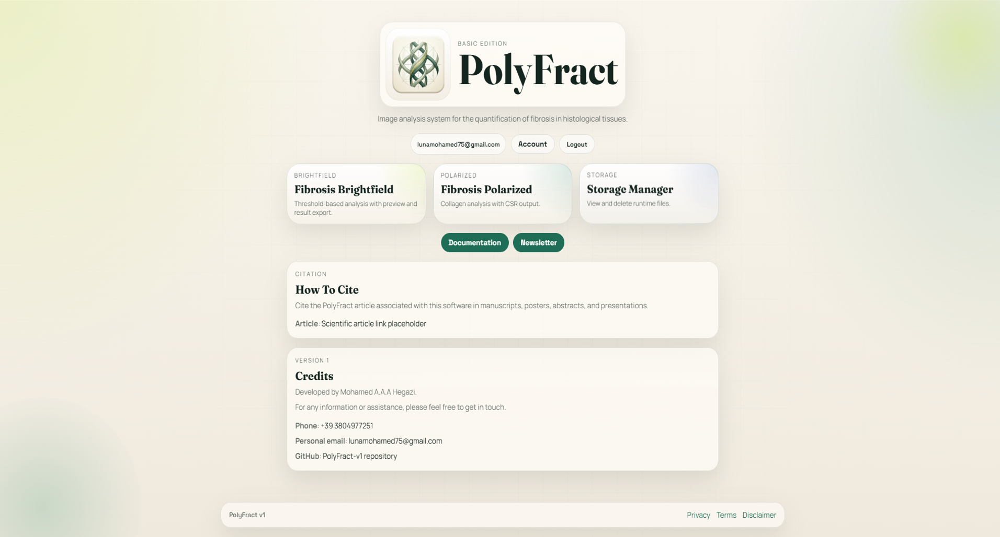
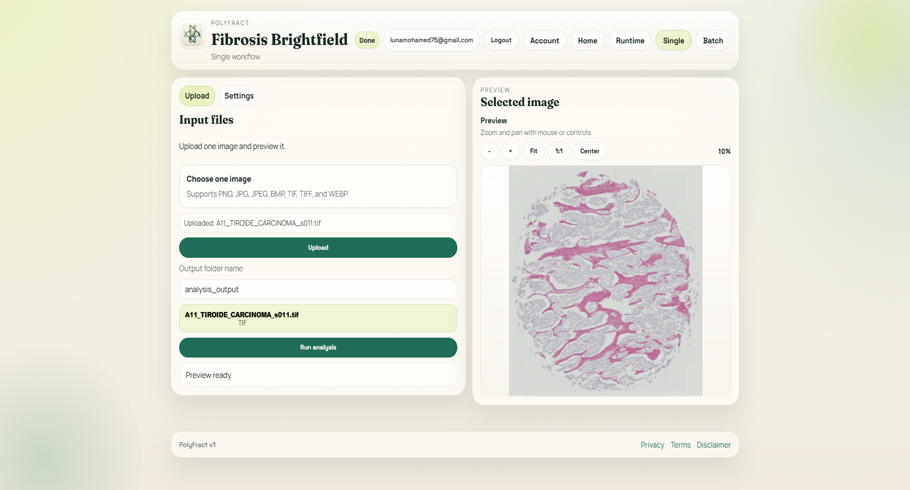
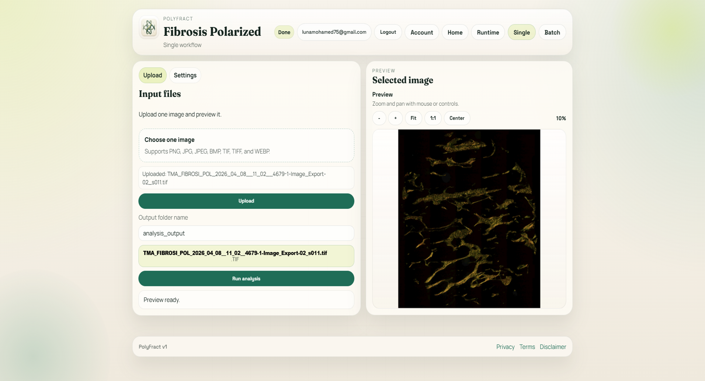

<p align="center">
  
</p>

<h1 align="center">PolyFract v1</h1>

<p align="center">
  Digital pathology platform for reproducible fibrosis quantification in histological tissue samples.
</p>

<p align="center">
  <a href="https://github.com/MohamedAhmedAhmedAbdelazizHegazi/PolyFract-v1/releases/latest">Downloads</a>
  &nbsp;·&nbsp;
  <a href="#try-the-demo-first">Try the demo</a>
  &nbsp;·&nbsp;
  <a href="#contact">Contact</a>
</p>

## Try The Demo First

**[Download PolyFract v1 Demo](https://github.com/MohamedAhmedAhmedAbdelazizHegazi/PolyFract-v1/releases/latest/download/PolyFract-v1-Demo-Setup.exe)** — Windows installer, no licence key, no account.

Two images come with the demo: a human skin biopsy stained with Sirius Red, photographed in brightfield and again under polarized light. Open either module and run it. The analysis is the same one the full version performs, and it produces the same output: masks, heatmaps, RD scaling plots, and spreadsheets.

Thresholds are already set for these two images. You can move them and watch the segmentation change before committing to a run, then put them back with one click.

The demo cannot open your own slides, run a whole slide set, or save protocol files. Those need the full version — see [Contact](#contact).

## Overview

PolyFract is designed to support structured fibrosis analysis through image segmentation, collagen-oriented quantification, heatmap-based spatial assessment, and exportable quantitative outputs.

The current release includes:

- Brightfield fibrosis analysis based on Sirius Red segmentation in HSV space
- Polarized fibrosis analysis with red/green channel quantification
- Heatmap generation and hotspot localization
- Excel-based quantitative output export
- Protocol save/load support for consistent analyses across sessions and samples
- Runtime storage management for uploaded files, previews, and generated outputs

## Why PolyFract

PolyFract is built for users who need fibrosis quantification workflows that are practical, repeatable, and export-oriented.

It is intended to help:

- reduce subjective variation in visual fibrosis assessment
- standardize output generation across cases and batches
- support comparison across samples with consistent parameters
- produce structured files that are immediately usable for downstream review and analysis

## Key Features

- Brightfield Sirius Red segmentation workflow
- Polarized collagen signal quantification workflow
- Heatmap generation with hotspot localization
- Excel-ready quantitative result export
- Protocol save/load for reproducible parameter reuse
- Desktop installer with guided setup
- Direct local access from the desktop app home page

## Desktop Download

The demo installer and the quick start guide are published on the **[Releases page](https://github.com/MohamedAhmedAhmedAbdelazizHegazi/PolyFract-v1/releases/latest)**.

| File | Purpose |
| --- | --- |
| [`PolyFract-v1-Demo-Setup.exe`](https://github.com/MohamedAhmedAhmedAbdelazizHegazi/PolyFract-v1/releases/latest/download/PolyFract-v1-Demo-Setup.exe) | evaluate PolyFract on the two bundled samples |
| [`PolyFract_Quick_Start_Guide_EN.pdf`](https://github.com/MohamedAhmedAhmedAbdelazizHegazi/PolyFract-v1/releases/latest/download/PolyFract_Quick_Start_Guide_EN.pdf) | installation and first-use guide |

To use the demo:

1. Download the installer.
2. Download the quick start guide.
3. Run the installer.
4. Follow the guide during installation and first use.
5. Open the application and start the required analysis workflow.

Requires Windows 10 or 11, 64-bit. The Microsoft Edge WebView2 Runtime is installed automatically if it is not already present, and no internet connection is needed during setup.

**The full version is not distributed from this page.** It is provided directly to licensed users and collaborators; see [Requesting The Full Version](#requesting-the-full-version).

If you only want to use the application, you do not need to download or run the Python source code.

## Screenshots

### Homepage



### Brightfield Workflow



### Polarized Workflow



## Scientific Relevance

PolyFract is intended for digital pathology workflows where fibrosis burden, collagen distribution, and tissue remodeling need to be quantified in a repeatable way across samples and cohorts.

The platform is particularly suited for:

- histological fibrosis assessment in pathology and biomedical workflows
- Sirius Red brightfield image quantification
- polarized light collagen analysis
- comparative workflows requiring standardized output tables and reproducible parameter reuse

By combining image-derived masks, hotspot maps, and exportable quantitative summaries, PolyFract helps move from descriptive visual inspection toward more structured and reproducible fibrosis analysis.

## Quantitative Outputs

PolyFract is designed to produce outputs that are useful for downstream statistical analysis, method comparison, and study reporting.

Core outputs include:

- fibrosis masks and annotated tissue images
- heatmaps and hotspot visualizations
- Excel tables for single-sample and batch workflows
- reproducible protocol files for parameter reuse

Core quantitative descriptors include:

- fibrosis-positive area
- tissue area
- fibrosis percentage relative to analyzed tissue
- fractal dimension for segmented fibrosis architecture
- heatmap dispersion metrics including mean, SD, and RD%
- polarized red and green channel measurements
- Collagen Signal Ratio `(CSR)`

## Main Workflows

### Brightfield

Brightfield analysis segments Sirius Red positive fibrosis and tissue regions from histological images.

Outputs include:

- `sirius_red_mask.png`
- `tissue_analyzed.png`
- `heatmap.png`
- `hotspot.png`
- `heatmap_statistics.xlsx`
- `fractal_dimension_heatmap.png`
- `fractal_dimension_heatmap_statistics.xlsx`
- `fractal_dimension_scaling_heatmaps/`
- `fractal_dimension_rd_scaling_statistics.xlsx`
- `fractal_dimension_rd_scaling_plot.png`
- `rd_scaling_heatmaps/`
- `rd_scaling_statistics.xlsx`
- `rd_scaling_plot.png`
- `sirius_red_quantification.xlsx`
- `sirius_red_quantification_summary.xlsx` in batch mode

Computed metrics include:

- Sirius Red area `(px)`
- Tissue area `(px)`
- Sirius Red area `(\%)`
- Fractal Dimension from box-counting on the segmented fibrosis mask
- Heatmap, RD, and RD scaling for Sirius Red area
- Heatmap, RD, and RD scaling for local fractal dimension

### Polarized

Polarized analysis thresholds red and green channels and derives collagen distribution metrics.

Computed metrics include:

- Red channel statistics
- Green channel statistics
- Collagen Signal Ratio `(CSR)`
- Heatmap mean, SD, RD%, valid boxes, and grid size

## Protocol Reproducibility

PolyFract supports saving and loading protocol files directly from the analysis interface.

This allows you to:

- reuse the same thresholds and settings across sessions
- keep batch runs consistent
- standardize analysis settings across different datasets or projects

## Runtime Data

During source-code execution, the application writes temporary and generated files under `runtime/`.

In the installed Windows desktop build, runtime data is written under:

```text
%LOCALAPPDATA%\PolyFract v1\runtime
```

The demo keeps its own separate workspace, so the two editions never share runtime data and can be installed side by side:

```text
%LOCALAPPDATA%\PolyFract v1 Demo\runtime
```

This includes:

- uploads
- previews
- outputs

These runtime artifacts should generally not be committed to GitHub.
The desktop build scripts and installer sources stay in the repository, while generated binaries and the local WebView2 bootstrapper remain ignored.

If the installed desktop application cannot start, PolyFract writes a startup traceback here:

```text
%LOCALAPPDATA%\PolyFract v1\runtime\crash\desktop_startup_error.log
```

If the desktop shell starts but the embedded Flask app fails later, inspect:

```text
%LOCALAPPDATA%\PolyFract v1\runtime\crash\app_runtime.log
```

## Citation And Collaborations

If you use PolyFract in research work, abstracts, posters, or manuscripts, cite the software name, version, repository, and access date.

Suggested citation format:

`PolyFract v1`, Mohamed A.A.A. Hegazi, GitHub repository: `MohamedAhmedAhmedAbdelazizHegazi/PolyFract-v1`, accessed on `[date]`.

For scientific collaborations, validation studies, or institutional use, please contact the developer directly.

## Contact

- **Developer**: Mohamed A.A.A. Hegazi
- **Official email**: polyfract@gmail.com
- **GitHub**: https://github.com/MohamedAhmedAhmedAbdelazizHegazi/PolyFract-v1

### Requesting The Full Version

To request the complete software, a demonstration, or a collaboration, contact any of the following addresses:

- lunamohamed75@gmail.com
- mohamed.ahmedahmedabdelazizhegazi@humanitasresearch.it
- fabio.grizzi@humanitasresearch.it
- histology@humanitasresearch.it

## Notes

- Use threshold preview before running the final analysis when tuning segmentation settings.
- Save protocol settings and reload them later to keep the same analysis configuration across runs.
- Keep the same quadrat count when comparing heatmap statistics across samples.
- Review `runtime/` regularly or use the Storage Manager page to clean generated files.
